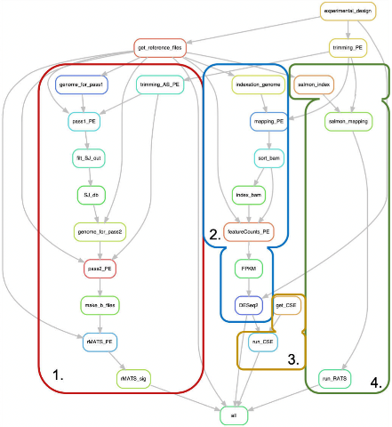

## Global workflow 

First step : Data cleaning (Optionnal)

Second step : Get references files (reference genome, transcriptome)
Then:
1. Differently Alternatively Spliced Genes (DASG)
2. Differently Expressed Genes (DEG)
3. ChromatineStateEnrichment (from DEG list)
4. Diffential Transcrits Usage (DTU)

## Prerequires

If it isn't install, please download Miniconda latest-version here (https://docs.conda.io/en/latest/miniconda.html)

After that, download the RNA_Seq_Pipeline project:
> git clone https://github.com/vindarb/RNA_Seq_Pipeline.git

And go in the repository 
> cd RNA_Seq_Pipeline 

To create the environment to run the analysis:

on macx OS:
> conda env create -f envs/macos.yml

> conda activate macos

Also for macos, please install gawk:

> brew install gawk

on Linux:
> conda env create -f envs/linux.yml

> conda activate linux

## Configure the experimental design of the analysis, and which parts of the analysis to execute

This step is the more important. 
The "config.yaml" file indicates important parameters to correctly execute the pipeline. For exemple, the extension of fastq files (default: .fastq.gz ), the reads length ..

By default, all the steps are executed:
 - DEG (Differently Expressed Genes)
 - DTU (DIffenrially Transcrits Usage)
 - DASG (Differently Alternatively Spliced Genes)
 - CSE (Chromatin State Enrichment)
 
If you don'y want to use one of the step, please put the variable "exec" to "False"
 > DEG : 

 >  exec : False

#### WARNING 

If you want to perform CSE analysis, DEG analysis must also be executed.

If you want to only perform CSE analysis, please download the tool individually :
(https://github.com/Darbinator/ChromatineStateEnrichment)

## Files and Folders
#### - Experience/ 

This folder must include all raw files (.fastq format) for the analysis. The nomenclature to use for the files name is as follows:
 - paired-ends reads: {nameOfCondition}_{n°ofReplicate}_R1.fastq.gz, {nameOfCondition}_{n°ofReplicate}_R2.fastq.gz
 - single-ends reads: {nameOfCondition}_{n°ofReplicate}.fastq.gz

For exemple, for paired-ends reads from two conditions with two replicates:

Experience/Col_1_R1.fastq.gz  
Experience/Col_2_R1.fastq.gz  
Experience/Col_1_R2.fastq.gz  
Experience/Col_2_R2.fastq.gz  
Experience/Mut_1_R1.fastq.gz  
Experience/Mut_1_R2.fastq.gz  
Experience/Mut_2_R1.fastq.gz  
Experience/Mut_2_R2.fastq.gz  

In this case, the file name 
#### ! WARNING !

If you don't want to run the trimming step (for exemple if the fastq files are already trimmed, you have to include the fastq files in the <b> Trimming/ </b> folder and add ".trim" extension in the file name as follow:

Trimming/Col_1_R1.trim.fastq.gz  
Trimming/Col_1_R2.trim.fastq.gz  
etc

#### - example/ 

Include small .fastq file in order to try the pipeline. To achieve this, check that the Experience/ folder is empty and move the examples files like this:

> mv example/* Experience/

#### rules
/
Include all rules in .smk files to indicate to Snakemake which files to generate.

#### scripts/

Additional python and R scripts (for exemple, DEG.R is necessary to run DESeq2)

#### Snakefile 

This file is read by Snakemake to run the pipeline, "Snakefile" is the default name, to launch the pipeline, you have to be in the parent folder (RNA_Seq_Pipeline/ ), and execute the command line:
> snakemake

If for some reasons the name of the snakefile is no longer "Snakefile", you have to specify the snakefile name as follow:
> snakemake --snakefile Snakefile_Name

#
